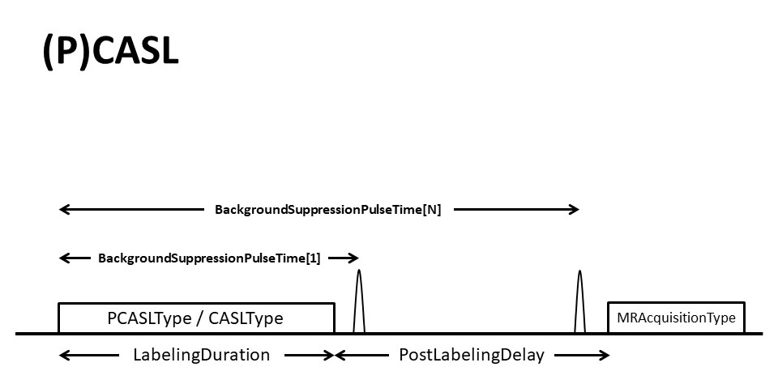
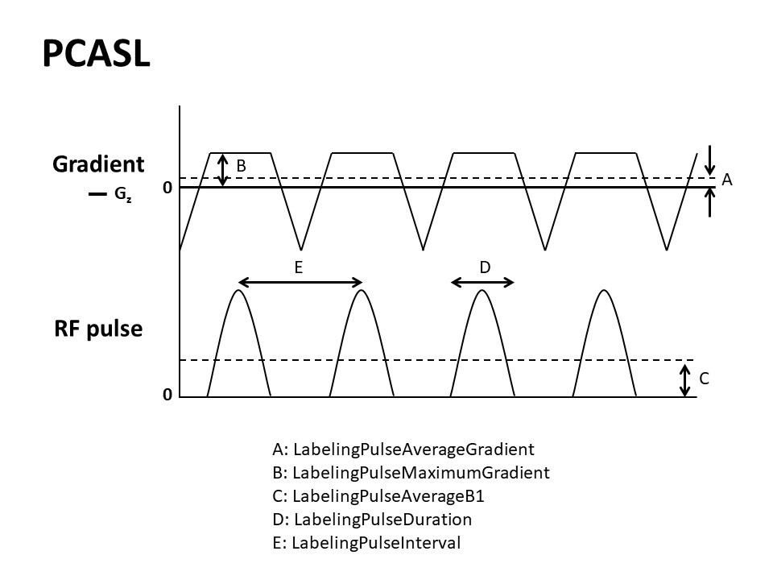
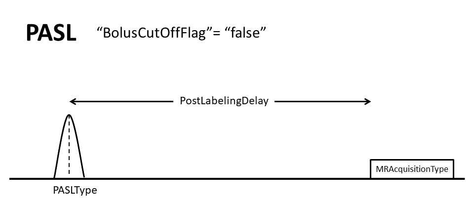

# Appendix X: Arterial Spin Labeling

This sections provides additional clarification for some specific topics within the BIDS specification for Arterial Spin Labeling.

## What is `control` and `label`?

The `control` image is acquired in the exact same way as the `label` image, except that the magnetization of the blood flowing into the imaging region has not been inverted. The 
`label` image is acquired in the exact same way as the `control` image, except that the blood magnetization flowing into the imaging region has been inverted. In case of doubt 
which image should be called `control` and which image should be called `label`, an easy rule of thumb is that the `deltaM`=`control`-`label` subtraction should result in a 
positive sign. For example, in the case of FAIR this would be selective inversion (`control`) and non-selective inversion (`label`).

## Summary Image of the most common ASL sequences

The following images illustrate the main BIDS metadata fields for three `ArterialSpinLabelingType`'s: `CASL`, `PCASL`, and `PASL`. Images are courtesy of, and adapted with 
permission from Y. Suzuki and OSIPI Task force 4.1: ASL lexicon milestone 1 "[Standard ASL techniques and parameters in brain perfusion imaging](https://www.osipi.org/task-force-4-1/)".

*For (P)CASL, specifying the `LabelingDuration` and the `PostLabelingDelay` required. The `LabelingDuration` is defined as the total duration of the labeling pulse train, in 
seconds, corresponding to the temporal width of the labeling bolus for (P)CASL. `PostLabelingDelay` is the time, in seconds, after the end of the labeling until the middle of 
the excitation pulse applied to the imaging slab (for 3D acquisition) or first slice (for 2D acquisition). Additionally, the `BackgroundSuppressionPulseTime`'s is required in 
case `BackgroundSuppression` was applied. This an array of numbers containing the timing, in seconds, of the background suppression pulses with respect to the start of the 
labeling. In case of `PCASL`, the recommended `PCASLType` field defines the type of the gradient pulses used in the `control` condition (`balanced` or `unbalanced`), whereas, in 
case of `CASL`, the recommended `CASLType` field describes if a separate coil is used for labeling (`single-coil` or `double-coil`).*

## Flowchart (based on dependency table)
