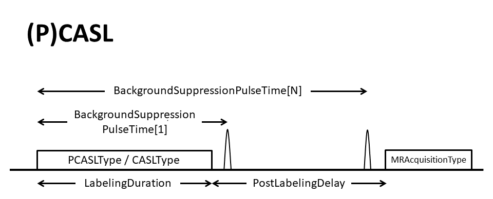
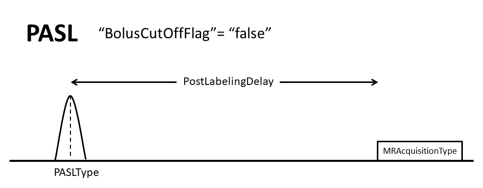
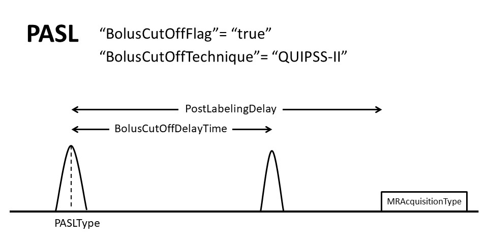
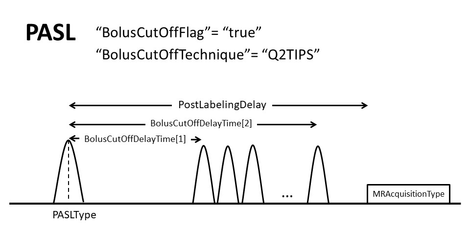

# Appendix X: Arterial Spin Labeling

This sections provides additional clarification for some specific topics within the BIDS specification for Arterial Spin Labeling.

## `control` and `label` definition

The `control` image is acquired in the exact same way as the `label` image, except that the magnetization of the blood flowing into the imaging region has not been inverted. The 
`label` image is acquired in the exact same way as the `control` image, except that the blood magnetization flowing into the imaging region has been inverted. In case of doubt 
which image should be called `control` and which image should be called `label`, an easy rule of thumb is that the `deltaM`=`control`-`label` subtraction should result in a 
positive sign. For example, in the case of FAIR this would be selective inversion (`control`) and non-selective inversion (`label`).

## Summary Image of the most common ASL sequences

## Flowchart (based on dependency table)
